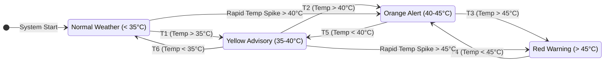

# State Transition Diagram

This is the main flowchart for your poster. It visually represents how the system moves from one state to another based on temperature triggers.

*(Note: When you view this file in a Markdown viewer or copy the code into a mermaid live editor like https://mermaid.live, it will generate a beautiful State Transition Flowchart you can screenshot for your poster!)*
